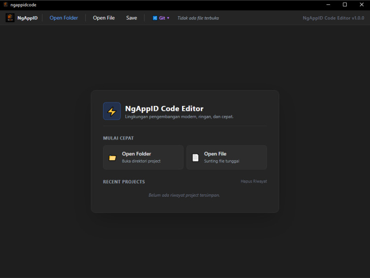
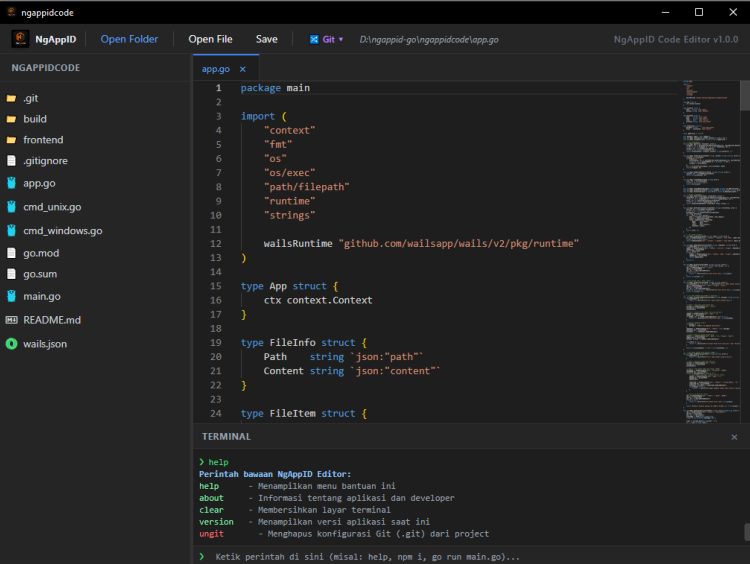

# 🚀 NgAppID Code Editor

**NgAppID Code Editor** adalah code editor desktop ringan, modern, dan *feature-rich* yang dirancang khusus untuk para developer yang menginginkan pengalaman ngoding cepat tanpa ribet. Dibangun menggunakan teknologi web modern di sisi antarmuka dan performa tinggi di backend untuk menjamin eksekusi yang responsif.

---

## 🖼️ Tampilan Aplikasi

<p align="center">
  
  
</p>

---

## 🛠 Tech Stack
* **Frontend:** 
  
  
  
* **Backend:** 
  
  
* **Bridge:** 
  
  
  

---

## ✨ Fitur Unggulan

### 1. 📁 File & Project Management
* **Open & Save File:** Mendukung pembukaan dan penyimpanan file kode secara langsung dengan integrasi *shortcut* keyboard (`Ctrl+S`).
* **Explorer Sidebar:** Navigasi folder project persisten yang mempertahankan status folder terbuka, lengkap dengan ikon teknologi spesifik (Go, PHP, JS, HTML, CSS, dll.).
* **Git Status Color Coding:** File yang dimodifikasi (`Modified` - Kuning) atau file baru (`Untracked` - Hijau) langsung di-*highlight* di sidebar secara *real-time*.
* **File Operations:** Buat file/folder baru, *rename*, dan hapus file langsung dari *interface* editor.

### 2. 🔀 Smart Git Integration (Ramah Pemula)
Alur otomatis di balik layar untuk mencegah *error* umum (seperti *exit status 128* atau *missing HEAD*):
* **Git Setup Wizard:** Konfigurasi *username*, *email*, dan URL *remote repository* secara interaktif melalui terminal bawah, tanpa *pop-up* yang mengganggu fokus.
* **Auto-Init & Auto-Commit:** Sistem secara cerdas mendeteksi jika folder belum memiliki *repository* atau riwayat *commit* awal, lalu membuatnya secara otomatis di *background* sebelum melakukan *push* atau *reset*.
* **One-Click Git Push & Pull:** Proses `add`, `commit`, dan `push` (beserta sinkronisasi *branch* `main`) diringkas dalam satu alur klik yang mulus.
* **Interactive Git Reset:** "Tombol panik" untuk mengembalikan kode ke *commit* terakhir secara aman dengan konfirmasi via terminal (`y/n`).

### 3. 💻 Integrated Terminal Panel
* Panel terminal bawah fungsional yang mendukung eksekusi perintah sistem operasi lokal (`cmd` / `sh`).
* Semua log aktivitas Git, *error*, maupun indikator sukses tercetak transparan dan berwarna di dalam terminal.
* Mengunci input otomatis saat memproses operasi *background* untuk mencegah penumpukan perintah.

### 4. 🛡 Clean UX (No Annoying Dialogs)
* Sistem notifikasi terpusat sepenuhnya di dalam log terminal agar layar tetap bersih.
* Pemblokiran klik kanan bawaan browser di area kosong untuk menjaga impresi dan fungsionalitas IDE profesional sejati.

---

## ⚙️ Cara Menjalankan Project (Development)

Pastikan di komputer kamu sudah terinstal **Go**, **Node.js**, dan **Wails CLI**.

1. *Clone* atau buka direktori project ini di terminal bawaan sistem kamu.
2. Jalankan perintah mode *development* Wails (mendukung *live reload*):
   ```bash
   wails dev
   ```

---

## 👨‍💻 Author, Support, & Dedication

Dikembangkan dengan ☕ oleh **YedinCoder** dan bersifat 100% *Open Source*.

* **Email:** yedincoder@gmail.com
* **WhatsApp:** 081802161315
* **Website:** [ngappid.com](https://ngappid.com) | [dev.ngappid.com](https://dev.ngappid.com)

> ❤️ **Spesial:** 
> *Sebuah karya untuk kemudahan developer di seluruh Nusantara. Didedikasikan dengan segenap cinta untuk **Zawjatii**, serta tiga pelita hati: **Shafa**, **Ra'uf**, dan si bungsu **Sa'ad**.*

*Dukungan pengembangan aplikasi secara sukarela (seikhlasnya) melalui QRIS, untuk menghargai kerja keras pengembangan project ini! 🙏☕*